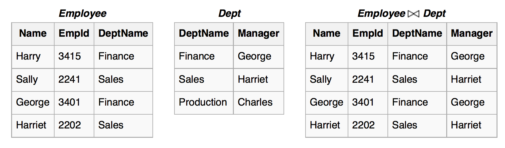

## Relacijski model

- star več kot 35 let,
- uporablja se v večini večjih poslovnih sistemov,
- enostaven za razumevanje, pregleden,
- omogoča zmogljive poizvedbe v standardiziranem jeziku SQL,
- podpira učinkovite implementacije.

## Relacijska algebra in SQL

- *Relacijska algebra* je matematični opis operacij nad relacijami (tabelami).
- Jezik SQL (Standard Query Language) je implementacija relacijske algebre v obliki poizvedovalnega jezika.
- Operatorji so operacije, ki sprejmejo relacije (tabele) in vrnejo (nove) relacije (tabele).

## Operatorji relacijske algebre {.smaller}
- *Shema relacije* = definicija tabele (imena + tipi).
- Operatorji so odvisni od shem relacij nad katerimi jih izvajamo.
- $\sigma_{p}(R)$ - izberi vrstice v relaciji $R$, ki ustrezajo pogoju $p$. Pogoj je lahko logični izraz. Shema vrnjene tabele je ista.
- $\pi_{a_1, a_2, \ldots, a_n}(R)$ - izberi stolpce z imeni $a_1, a_2, \ldots, a_n$ relacije $R$ in vrni novo tabelo s shemo, ki jo določajo definicije teh stolpcev. Število vrstic ostane enako.
- $\rho_{a/b}(R)$ - spremeni ime stolpcu $a$ v $b$. Vrni enako tabelo (glede vrstic), le z drugo shemo.
- $R \cup S$ - vrni relacijo z unijo vrstic, če imata relaciji $R$ in $S$ enaki shemi.
- $R \setminus S$ - vrni relacijo z razliko vrstic, če imata relaciji $R$ in $S$ enaki shemi.
- $R \times S$ - vrni kartezični produkt relacij (vsaka vrstica $R$ z vsako vrstico $S$). Shema rezultata sta združeni shemi.

## JOIN 

$R \bowtie S = \pi_{\scriptsize shema(R) \cup shema(S)}( \sigma_{\scriptsize R.a_1 = S.a_1 \land R.a_2 = R.a_2 \land \ldots}(R \times S))$

```{r echo=FALSE, out.width='100%'}

```

<font size="2px"> Vir: Wikipedia. </font>

## SQL

- Standard Query Language.
- Primeri iz tabele na SQLZOO
    - http://sqlzoo.net/wiki/SELECT_from_WORLD_Tutorial
    - http://sqlzoo.net/wiki/SELECT_from_BBC_Tutorial
    - http://sqlzoo.net/wiki/SELECT_from_Nobel_Tutorial
- Ogledali si bomo stavke `SELECT`, `INSERT`, `UPDATE`, `DELETE`.

## SELECT {.build}

Stavek `SELECT` kot projekcija.

  * Izberi stolpca `population` in `name` iz tabel [`world`](http://sqlzoo.net/wiki/SELECT_from_WORLD_Tutorial):
```{sql eval=FALSE}
SELECT population, name FROM world
```
- Izberi stolpca `name` in `population` in jih preimenuj v `drzava` ter `st_prebivalcev`.
```{sql eval=FALSE}
SELECT name AS drzava, population AS st_prebivalcev 
  FROM world
```
- Izberi stolpec `name` in ga preimenuj v `Ime države`. 
```{sql eval=FALSE}
SELECT name AS "Ime države" FROM world
```
- To v splošnem ni dobra praksa (šumniki v imenih, zgodovinsko, ...)

## SELECT {.build}

- Katere različne regije nastopaj v tabeli [`bbc`](http://sqlzoo.net/wiki/SELECT_from_BBC_Tutorial)?
```{sql eval=FALSE}
SELECT DISTINCT region FROM bbc 
```
- Kateri različni kontinenti nastopajo v tabeli [`world`](http://sqlzoo.net/wiki/SELECT_from_WORLD_Tutorial)?
```{sql eval=FALSE}
SELECT DISTINCT continent FROM world
```


## SELECT ... WHERE {.smaller .build}

Stavek `SELECT ... WHERE` kot projekcija z izbiro vrstic v skladu s pogoji.

- Vse vrstice v tabeli [`world`](http://sqlzoo.net/wiki/SELECT_from_WORLD_Tutorial), ki pripadajo državam v Evropi
```{sql eval=FALSE}
SELECT * FROM world WHERE continent ='Europe'
```
- Možni relacijski operatorji so:
    - `=`, `<>`, `!=`, `<`, `<=`, `>`, `>=`
    - `IS NULL`, `IS NOT NULL`
    - `e BETWEEN a AND b`
    - `e NOT BETWEEN a AND b`
    - `e IN (v1, v2, ...)`
    - `e NOT IN (v1, v2, ...)`
- Pogoje lahko sestavljamo z logičnimi vezniki : `NOT`, `AND`, `OR`, `XOR`

## Izrazi v SELECT  {.build}

- Za vsako državo v tabeli [`world`](http://sqlzoo.net/wiki/SELECT_from_WORLD_Tutorial) izračunaj razmerje med prebivalstvom in površino.
```{sql eval=FALSE}
SELECT name, population / area 
  FROM world 
  WHERE continent = 'Europe'
```
- Še z ustreznim preimenovanjem.
```{sql eval=FALSE}
SELECT name AS ime_drzave, 
       population / area AS gostota_prebivalstva 
   FROM world 
   WHERE continent = 'Europe'
```

## Izrazi v SELECT  {.build}

- Dodajmo še pogoj da je število prebivalcev večje od 2mio.
```{sql eval=FALSE}
SELECT name AS "ime države", 
       ROUND(population / area, 2) 
           AS "gostota prebivalstva" 
  FROM world 
  WHERE continent = 'Europe' AND population > 2000000
```
- [Funkcije](http://sqlzoo.net/wiki/FUNCTIONS), ki jih lahko uporabljamo.
```{sql eval=FALSE}
SELECT name, ROUND(population/1000000) AS prebiMilion 
  FROM world 
  WHERE continent IN ('Asia', 'Europe') 
        AND name LIKE 'C%'
```

## `ORDER BY` - urejanje tabel {.build}

- Urejanje po stolpcu `population` v tabeli [`world`](http://sqlzoo.net/wiki/SELECT_from_WORLD_Tutorial)
```{sql eval=FALSE}
SELECT name, population 
  FROM world 
  ORDER BY population
```
- Urejanje po 2. stolpcu.
```{sql eval=FALSE}
SELECT name, population 
  FROM world 
  ORDER BY 2
```
- V padajočem vrstnem redu.
```{sql eval=FALSE}
SELECT name, population 
  FROM world 
  ORDER BY population DESC
```

## `ORDER BY` - urejanje tabel {.build}

- Urejanje po izračunanem stolpcu.
```{sql eval=FALSE}
SELECT name 
  FROM world 
  WHERE continent = 'Europe' 
  ORDER BY population/area
```
- Urejanje po `continent` in potem še po `name`.
```{sql eval=FALSE}
SELECT continent, name 
  FROM world  
  ORDER BY continent, name
```

## Podpoizvedbe {.build}

- Uporabimo rezultat poizvedbe za izračun pogojev v drugi poizvedbi.
- Katere države na svetu imajo manj prebivalcev kot Slovenija? Podatki iz tabele [`world`](http://sqlzoo.net/wiki/SELECT_from_WORLD_Tutorial).
```{sql eval=FALSE}
SELECT name FROM world WHERE 
  population <= (SELECT population 
      FROM world WHERE name='Slovenia')
```
- Katere države na svetu imajo več ali enako prebivalcev kot Kanada in manj ali enako kot Alžirijo?
```{sql eval=FALSE}
SELECT name FROM world WHERE population BETWEEN 
     (SELECT population FROM world WHERE name='Canada') 
     AND 
     (SELECT population FROM world WHERE name='Algeria')
```   

## Podpoizvedbe {.build}

- Podpoizvedbe morajo imeti ustrezno število stolpcev in vrstic glede na uporabljene operatorje.
- V katerih letih je bila podeljena Nobelova nagrada za fiziko in ni bila za kemijo? Podatki iz tabel [`nobel`](http://sqlzoo.net/wiki/SELECT_from_Nobel_Tutorial)
```{sql eval=FALSE}
SELECT DISTINCT yr 
  FROM nobel 
  WHERE subject = 'physics' AND 
      yr NOT IN (SELECT yr FROM nobel 
                WHERE subject = 'chemistry')
```

## Združevalne funkcije {.build}

- Povprečno število prebivalcev na državo v Evropi. Podatki iz tabele [`world`](http://sqlzoo.net/wiki/SELECT_from_WORLD_Tutorial).
```{sql eval=FALSE}
SELECT AVG(population) 
  FROM world 
  WHERE continent='Europe'
```
- Maksimalno število prebivalcev v afriški državi.
```{sql eval=FALSE}
SELECT MAX(population) 
  FROM world 
  WHERE continent='Africa'
```

## Združevalne funkcije {.build}

- Najmanša površina države na svetu. 
```{sql eval=FALSE}
SELECT MIN(area) FROM world
```
- Zakaj je enaka 0?
```{sql eval=FALSE}
SELECT name, area FROM world 
  WHERE area = 0
```
```{sql eval=FALSE}
SELECT MIN(area) FROM world WHERE area > 0
```
```{sql eval=FALSE}
SELECT SUM(gdp) FROM world 
  WHERE continent='Europe'
```
- Nekatere vrstice imajo polje `gdp` enako `NULL`. Funkcije za združevanje ignorirajo vrednosti `NULL`.

## COUNT {.build}

- Koliko je vrstic v tabeli [`world`](http://sqlzoo.net/wiki/SELECT_from_WORLD_Tutorial)?
```{sql eval=FALSE}
SELECT COUNT(*) FROM world 
```
- Koliko je vrstic v tabeli `world`, ki imajo `gdp` različen od `NULL`?
```{sql eval=FALSE}
SELECT COUNT(gdp) FROM world 
```
- Koliko je različnih kontinentov?
```{sql eval=FALSE}
SELECT COUNT(DISTINCT continent) FROM world
```
- Koliko krat se pojavi beseda `Asia` v kontinentu?
```{sql eval=FALSE}
SELECT COUNT(*) FROM world 
  WHERE continent LIKE '%Asia%'
```

## Primeri {.build}

- Kako pa je z uporabo združevalnih funkcij v pogoju? Podatki iz tabele [`world`](http://sqlzoo.net/wiki/SELECT_from_WORLD_Tutorial).
```{sql eval=FALSE}
SELECT name, population 
  FROM world 
  WHERE continent='Africa' AND 
        population = MAX(population)
```
- Funkcije za združevanje lahko uporabljamo le v prvem delu stavka `SELECT`.
```{sql eval=FALSE}
SELECT name, population 
  FROM world 
  WHERE continent = 'Africa' AND 
    population = (SELECT MAX(population) 
        FROM world 
        WHERE continent = 'Africa'
    )
```

## Primeri {.build}
- Poišči imena tistih držav, ki imajo bruto družbeni proizvod večji od vseh evropskih držav. Podatki iz tabele [`world`](http://sqlzoo.net/wiki/SELECT_from_WORLD_Tutorial).
```{sql eval=FALSE}
SELECT name FROM world 
  WHERE gdp > (SELECT MAX(gdp) 
    FROM world 
    WHERE continent = 'Europe')
```
```{sql eval=FALSE}
SELECT name FROM world 
  WHERE gdp > ALL  (SELECT gdp FROM world 
        WHERE continent = 'Europe' 
        AND gdp IS NOT NULL)
```
- Za primerjavo z `NULL` moramo vedno uporabiti `IS NULL` ali `IS NOT NULL`. Nikoli `=` ali `<>`

## Primeri {.build}

- V tabeli [`bbc`](http://sqlzoo.net/wiki/SELECT_from_BBC_Tutorial) Poiščimo države z maksimalnim številom prebivalstva v svoji regiji.
```{sql eval=FALSE}
SELECT region, name, population FROM bbc t1
  WHERE population >= ALL
    (SELECT population FROM bbc t2
        WHERE t1.region = t2.region
          AND population > 0)
```
- Podpoizvedbo si predstavljamo, kot da je pri filtriranju posamezne vrstice parametrizirana z `t1.region`.

## GROUP BY {.build}

- Maksimalno število prebivalcev države na vsaki celini. Podatki iz tabele [`world`](http://sqlzoo.net/wiki/SELECT_from_WORLD_Tutorial). 
```{sql eval=FALSE}
SELECT continent, population FROM world x
  WHERE population >= ALL
    (SELECT population FROM world y
        WHERE y.continent = x.continent
          AND population > 0)
```
- `GROUP BY` - razdeli tabelo na skupine definirane z istimi vrednostmi stolpcev, ki so navedeni za `GROUP BY`. 
- Vsaka skupina vrne kot rezultat eno vrstico. Zato morajo biti morebitni ostali stolpci navedeni v `SELECT` agregirani s kako od združevalnih funkcij.
```{sql eval=FALSE}
SELECT continent, MAX(population) 
    FROM world 
    GROUP BY continent
```

## HAVING {.build}

- Po posameznih regijah preštej tiste države, kjer je število prebivalcev več kot 200mio. Podatki iz tabele [`world`](http://sqlzoo.net/wiki/SELECT_from_WORLD_Tutorial). 
```{sql eval=FALSE}
SELECT continent, COUNT(*) AS kolikoDrzav  
   FROM world 
   WHERE population > 200000000 
   GROUP BY continent
```
- Narobe - WHERE deluje pred združevanjem
```{sql eval=FALSE}
SELECT continent, SUM(population) 
    FROM world GROUP BY continent
    HAVING SUM(population) >= 500000000
```

## HAVING {.build}

- `HAVING` je dejansko `WHERE` nad vrsticami, ki predstavljajo skupine dobljene z `GROUP BY`. 
- Akumulirani stolpci uporabljeni v pogoju niso nujno v rezultatu.
```{sql eval=FALSE}
SELECT continent 
  FROM world 
  GROUP BY continent
  HAVING SUM(population) >= 500000000
```

## Primeri {.build}

- Podatki iz tabele [`nobel`](http://sqlzoo.net/wiki/SELECT_from_Nobel_Tutorial).
- Izpiši tista leta po letu 1970, ko je Nobelovo nagrado iz fizike (Physics) dobil le en posameznik. 
```{sql eval=FALSE}
SELECT yr FROM nobel 
  WHERE subject = 'Physics'  AND yr > 1970
  GROUP BY yr  
  HAVING COUNT(yr) = 1
```
- Kateri posamezniki so dobili Nobelovo nagrado na dveh ali več področjih?
```{sql eval=FALSE}
SELECT winner FROM nobel
  GROUP BY winner
  HAVING COUNT(DISTINCT subject) > 1
```

## Primeri {.build}

- Podatki iz tabele [`nobel`](http://sqlzoo.net/wiki/SELECT_from_Nobel_Tutorial).
- Prikaži tista leta in področja, kjer so bile v istem letu podeljene 3 nagrade ali več. Upoštevaj le leta po letu 2000.
```{sql eval=FALSE}
SELECT yr, subject 
  FROM nobel
  WHERE yr > 2000
  GROUP BY yr, subject
  HAVING COUNT(*) >= 3
  ORDER BY yr
```

## JOIN {.build}

- Podatki iz [tabel](http://sqlzoo.net/wiki/More_JOIN_operations) `movie`, `actor` in `casting`.
- V katerih filmih je igral `John Wayne`?
```{sql eval=FALSE}
SELECT title FROM movie 
  JOIN casting ON movie.id=movieid
  JOIN actor   ON actorid=actor.id
  WHERE actor.name='John Wayne'
```
- Z enim ali več `JOIN` združimo potrebne tabel in na ta način posredno izvajamo sklicevanje med tabelami.
- Kdo je poleg Jamesa Deana še igral v filmu Giant?
```{sql eval=FALSE}
SELECT name FROM movie 
  INNER JOIN casting ON movie.id = movieid
  INNER JOIN actor ON actor.id = actorid
  WHERE title = 'Giant' AND name <> 'James Dean'
```

## [Primer](http://sqlzoo.net/wiki/More_JOIN_operations) {.build}
- Izpiši tiste igralce, ki so bili glavni igralci (`ord = 1`) v vsaj 10 filmih? 
```{sql eval=FALSE}
SELECT actor.name FROM actor 
  INNER JOIN casting ON actorid = id
  WHERE ord = 1
  GROUP BY actorid  
  HAVING COUNT(id) >= 10
```

- Kaj pa, če nas zanima še v koliko filmih so bili glavni igralci?
```{sql eval=FALSE}
SELECT actor.name, count(actor.name) AS 'FILMI' FROM actor
  JOIN casting ON actorid = id
  WHERE ord = 1
  GROUP BY actorid 
  HAVING COUNT(id) >= 10
  ORDER BY FILMI DESC
```

## [Primer](http://sqlzoo.net/wiki/More_JOIN_operations) {.build}

- Kateri igralci so igrali v več kot enem filmu, ki ima v naslovu 'love'?
```{sql eval=FALSE}
SELECT name, COUNT(*) from movie 
  JOIN casting ON movie.id = movieid
  JOIN actor ON actor.id = actorid
  WHERE title LIKE '%love%'
  GROUP BY name
  HAVING COUNT(*) > 1
```

## Primer {.build}

- Zanimajo nas naslovi in glavni igralec vseh tistih filmov, kjer je igral Al Pacino in ni bil v glavni vlogi.
```{sql eval=FALSE}
SELECT movie.title, actor.name FROM movie 
  JOIN casting ON movie.id = movieid
  JOIN actor ON actor.id = actorid
  WHERE casting.ord = 1 AND movie.id IN 
      (SELECT movieid FROM casting 
        JOIN actor ON actor.id = actorid
        WHERE actor.name = 'Al Pacino'
      ) AND actor.name <> 'Al Pacino'
```

## INSERT {.build} - vstavljanje vrstic

- `INSERT` - stavek za vstavljanje vrstic.
```{sql eval=FALSE}
INSERT INTO ime_tabele VALUES 
      (vrednost_prvega_stolpca, ... , vred_zad_st)
```
- Naštejemo vse vrednosti za vse stolpce, tudi če so `NULL` ali avtomatično generirani.
- Poznati moramo vrstni red stolpcev v shemi.
```{sql eval=FALSE}
INSERT INTO ime_tabele (stolpec_1, stolpec_2, ...,stlpc_n) 
      VALUES (vred_stolpca_1, ... , vred_stolpca_n)
```
- Naštejemo le vrednosti za izbrane stolpce
- Ostali se nastavijo na `NULL` ali privzeto vrednost.

## INSERT {.build}

- za `VALUES` lahko naštejemo več vektorjev vrednosti (vrstic) in jih ločimo z vejico.    
- Vstavljamo lahko tudi rezultat `SELECT` stavka, če se ujema s shemo tabele.
```{sql eval=FALSE}
INSERT into ime_tabele 
        SELECT ... 
```
## UPDATE {.build} - popravljanje vrstic

- popravljanje vrednosti v tabeli v vrsticah, ki zadoščajo pogojem ter stolpcih v teh vrsticah, ki jih želimo spremeniti.
```{sql eval=FALSE}
UPDATE ime_tabele SET st1 = v1, st2 = v2, ... 
  WHERE pogoj
```

## DELETE {.build} - brisanje vrstic

- brisanje vrstic, ki zadoščajo pogoju.
```{sql eval=FALSE}
DELETE FROM ime_tabele 
  WHERE pogoj
```
