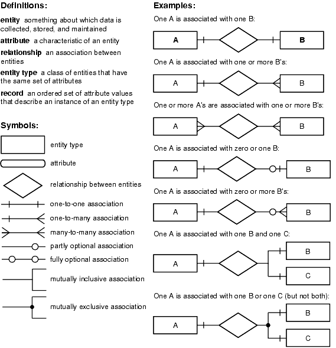
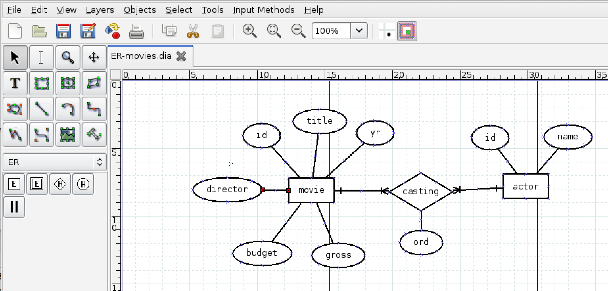
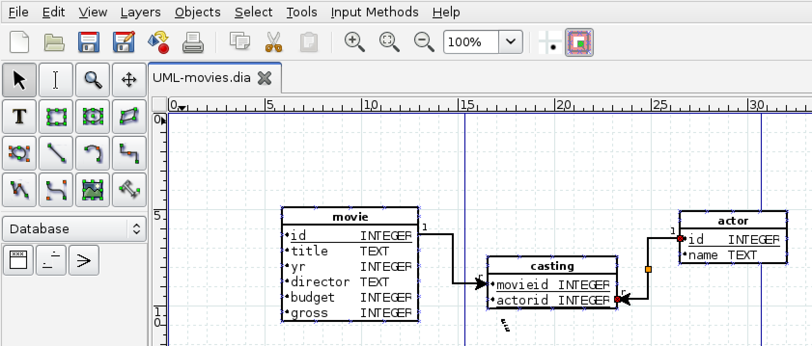
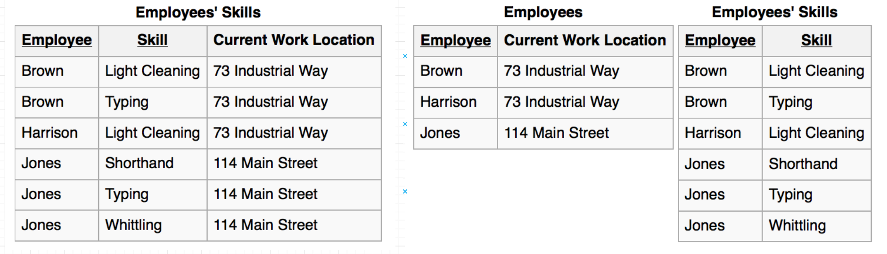
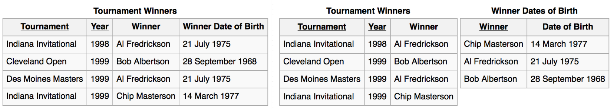

## Kako načrtujemo podatkovne baze?

- Pogovorimo se s končnimi uporabniki in zberemo zahteve.
- Narišemo konceptualni E-R Model (ali UML model).
- Pretvorimo E-R model v množico relacij.
- Izvedemo normalizacijo relacij (način eliminiranja podvajanja podatkov).
- Implementiramo podatkovno bazo v sistemu RDBMS.

## Grafični prikaz modelov

- Podatkovno bazo, tabele in sklice lahko načrtujemo s pomočjo grafično podprtih orodij.
- Vizualizacija nam omogoča preglednejši pogled na tabele v podatkovni bazi.
- Na voljo je več orodij.
- Odprtokodno orodje <a href="http://sourceforge.net/projects/dia-installer/"> Dia </a>
- Googlov <a href="http://draw.io">draw.io</a>
- OPOZORILO: sklice med tabelami v angleščini imenujemo tudi "relationship". V slovenščino to po tradiciji malce "nerodno" prevedemo v "relacija" (v relacijski algebri pa velja relacija = tabela) 
- Pazimo na kontekst uporabe pojma "relacija".

## E-R model

```{r echo=FALSE, out.width='60%'}

```

Vir: Oracle

## <a href="viri/ER_movies.dia">E-R model in Dia</a>

```{r echo=FALSE, out.width='100%'}

```

## <a href="viri/ER_movies.dia">UML model in Dia</a>

```{r echo=FALSE, out.width='100%'}

```

## Normalizacija

- *Normalizacija* je proces pri katerem sistematično pregledamo relacije (tabele) in anomalije. Ko identificiramo anomalijo, relacijo razbijemo na dve novi.
- Med procesom normalizacije ponavadi dobimo še globji vpogled, kakšna bo interakcija med podatki v podatkovni bazi.
- Bolje najti probleme v podatkovni bazi v času načrtovanja kot v času operacij.
- Normalizacija nam pomaga odstraniti redundantnost zapisa podatkov.
- Ampak zato moramo morda delati več `join`-ov.
- Včasih se zaradi učinkovitosti namerno odločimo, da ne izvedemo nekega koraka normalizacije (npr. v podatkovnih skladiščih).

## Predpostavke za relacije (tabele)

- Vsaka vrstica ima za določen stolpec samo eno vrednost.
- Podatki v stolpcu so istega tipa.
- Isto ime stolpca se lahko v relaciji pojavi le enkrat.
- Vrstni red stolpcev ni važen.
- Nobeni dve vrstici ne smeta biti enaki.
- Vrstni red vrstic ni važen.

## Funkcijska odvisnost

- *Funkcijska odvisnost* opisuje odnos med stolpci znotraj iste relacije (tabele).
- Stolpec `A` je funkcijsko odvisen od (enega ali več) stolpcev `A1, ..., An`, če lahko s pomočjo vrednosti teh stolpcev v neki vrstici impliciramo vrednost stolpca `A` v tej vrstici.
- Primer: Številka študenta implicira študij študenta.
- Za nakazovanje funkcijske odvisnosti uporabimo simbol `->`.
- Stolpec je lahko funkcijsko odvisen od kombinacije večih stolpcev.
- Primer: `Solsko_leto, Predmet -> Predavatelj`.
- Funkcijske odvisnosti so pogojene tako s strukturo tabel kot z naravo podatkov.

## Ključ

- Ključ: eden ali več stolpcev, ki enolično določajo vrstico.
- Izbor ključev temelji na konkretni aplikaciji baze. Kaj je ključ izvemo velikokrat iz konteksta in od uporabnikov.
- Za ključ vedno velja: `Ključ -> vsi ostali stolpci`.
- Obstajajo lahko funkcijske odvisnosti, ki na levi strani nimajo (samo) ključev.
- Kaj z njimi?

## Vrste normalizacij

- Prva normalizirana oblika (1NF)
- Druga normalizirana oblika (2NF)
- Tretja normalizirana oblika (3NF)
- Boyce-Codd normalizirana  (BCNF)
- Četrta normalizirana oblika (4NF)
- Peta normalizirana oblika (5NF)
- Vsaka naslednja oblika vsebuje prejšnjo.

## Normalizacija

- Normalizacija v ustrezno obliko poteka na naslednji način:

    - Določimo ključe vsake tabele.
    - Določimo funkcijske odvisnosti.
    - Preverimo, ali so kršene zahteve ustrezne definicije.
    - Če pride do kršitve v neki tabeli, potem to tabelo razdelimo na dve tabeli.
    - Ponovno preverimo pogoje za izbrano obliko.
    - Če za nobeno tabelo ni kršena nobena zahteva, zaključimo.


## 1NF = predpostavke za relacijo

- Vsaka vrstica ima za določen stolpec samo eno vrednost. 
- Podatki v stolpcu so istega tipa.
- Isto ime stolpca se lahko pojavi v tabeli le enkrat. 
- Vrstni red stolpcev ni važen.
- Nobeni dve vrstici ne smeta biti enaki.
- Vrstni red vrstic ni važen.
- Primer: če se identični vrstici ponovita v neki tabeli, potem tabela že ni v 1NF.

## <a href="http://holowczak.com/database-normalization/6/">2NF</a> {.build}

- Ključ (ang. superkey): katera koli skupina stolpcev, za katere ne obstajata dve vrstici z istima vrednostima v teh stolpcih. Vsi drugi stolpci so funkcijsko odvisni od stolpcev, ki določajo ključ. 
- 1NF - vsi stolpci skupaj določajo nek ključ.
- Minimalni ključ (ang. candidate key): ključ, za katerega nobena stroga podmnožica ne predstavlja ključa.
- Primarni ključ: izbrani minimalni ključ.
- Neključni stolpec: stolpec, ki ni v nobenem minimalnem ključu.

## 2NF {.build}

- 1NF + nobena stroga podmnožica kakega minimalnega ključa ne funkcijsko določa kak neključni stolpec.

```{r echo=FALSE, out.width='100%'}

```

## <a href="http://holowczak.com/database-normalization/7/">3NF </a> {.build}

- Pogoj: relacija je v 2NF in nimamo tranzitivnih funkcionalnih odvisnosti.
- Tranzitivna funkcionalna odvisnost: 
    - iz `A -> B`, `B -> C` sledi `A -> C`.

```{r echo=FALSE, out.width='100%'}

```


## <a href="http://holowczak.com/database-normalization/8/">BCNF</a>

- Boyce-Codd-ova normalizirana oblika.
- Pogoj: relacija je v 3NF in za vsako funkcionalno odvisnost oblike `A1, ..., An -> B` velja, da stolpci `A1, ..., An` predstavljajo ključ.

- Torej: ne obstajajo nobene druge funkcionalne odvisnosti razen od ključev.

- Ponavadi normaliziramo vsaj do te oblike.

## <a href="http://holowczak.com/database-normalization/9/">4NF</a>

- Pogoj: relacija je v BNCF in nima *multifunkcijske odvisnosti*.
- Multifunkcijska odvisnost: tip funkcijske odvisnosti, kjer eden ali nekaj stolpcev določa več vrednosti.
- `Student ->> Predmeti`
- Ostalih višjih normaliziranih oblik si ne bomo ogledali.

