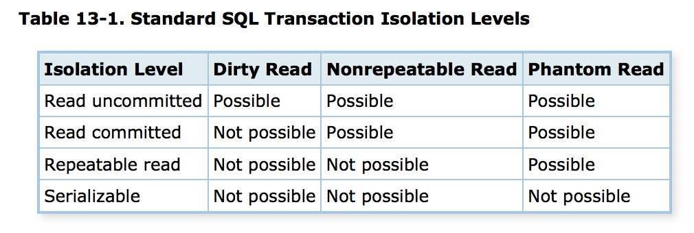

## Napredne funkcionalnosti na bazah

- Priklop na Sqlite in Postgres preko Pythona in R
- Namestitev Linuxa, Postgresql
- Uporabniki, vloge ter dostop
- Indeksi
- Transakcije
- Določanje dostopa
- Shranjene funkcije
- Prožilci (Triggerji)
- Pogledi (View)
- Ogledali si bomo na RDBMS PostgreSQL

## Sqlite in Postgres preko Pythona in R

- Ogledali si bomo konkretne primere (mapica `viri`).
- Za Postgres potrebujemo bazo, kjer imamo dovolj pravic.

## Namestitev Linuxa

- Virtualizacija: zaganjanje drugega operacijskega sistema (celotnega računalnika) kot programa.
- Virtualbox - program za virtualizacijo (Oracle).
- Iz spleta naložimo program [Virtualbox](https://www.virtualbox.org/).
- Iz spleta naložimo .iso sliko za namestitev operacijskega sistema [Linux Ubuntu Server](https://www.ubuntu.com/download/server).
- Po [navodilih](https://www.virtualzero.net/blog/how-to-install-ubuntu-server-18.04-lts-in-virtualbox) nastavimo virtualni računalnik in namestimo Linux.
- POZOR: za uporabnika nastavimo uporabniško ime `ubuntu` in dogovorjeno geslo.

## Osnovno delo v terminalu

- Namestili smo `Ubuntu Server`, ki omogoča samo terminalski dostop. 
- Lahko bi si namestili `Ubuntu Desktop`, ki ponuja tudi uporabo preko ukazne lupine.  
- V terminal se po zagonu prijavimo kot uporabnik `ubuntu`.
- Uporabnik `ubuntu` je član skupine `sudoers` in lahko preko ukaza `sudo` izvaja operacije s pravicami administratorja.
- Spoznamo se z nekaj [osnovnimi ukazi](https://help.ubuntu.com/community/Beginners/BashScripting#Commands) v ukazni lupini `bash`.

## Pomembni ukazi v `bash`

- `pwd` - v kateri mapi se nahajamo
- `ls` - izpis vsebine mape (`ls -l`, `ls -lt`)
- `cd` - spremeni mapo (`cd podmapa`, `cd ..`, `cd /home/ubuntu`, `cd`, ...)
- `cp` - kopiranje (`cp datoteka1 datoteka2`, `cp -r pot/do/mape pot/do/cilja`)
- `mv` - premikanje oz. preimenovanje (`mv datoteka1 datoteka2`, `mv mapa1 pot/do/mape2`)
- `rm` - briši (`rm datoteka`, `rm -r mapa`)
- `nano` - preprost tekstovni urejevalnik (`nano pot/do/datoteke.txt`)
- `sudo` - izvajanje ukazov z administratorskimi pravicami

## [Namestitev Postgresql](https://www.digitalocean.com/community/tutorials/how-to-install-and-use-postgresql-on-ubuntu-14-04) {.build}

- Nameščanje na Ubuntu izvajamo preko paketnega sistema in ukaza `apt-get`.
```{bash  eval=FALSE}
sudo apt-get update
sudo apt-get install postgresql postgresql-contrib
```
- Ob namestitvi se na sistemu ustvari uporabnik `postgres`, ki je tudi administrator na bazi.
- Vstop v vlogo (uporabnika) `postgres`:
```{bash  eval=FALSE}
sudo -i -u postgres
```


<!-- ## Ukazi na sistemu {.build} -->

<!-- - Ustvarjanje uporabnika v `bash` (interaktivno, navedemo pravice). -->
<!-- ```{bash  eval=FALSE} -->
<!-- createuser --interactive -->
<!-- ``` -->
<!-- - Vstop v vlogo (uporabnika). -->
<!-- ```{bash  eval=FALSE} -->
<!-- sudo -i -u uporabnisko_ime -->
<!-- ``` -->
<!-- - Izhod iz vloge. -->
<!-- ```{bash  eval=FALSE} -->
<!-- exit -->
<!-- ``` -->
<!-- - Ustvarjanje baze. -->
<!-- ```{bash  eval=FALSE} -->
<!-- createdb ime_baze -->
<!-- ``` -->

## Program `pqsl` {.build}

- Program za priklop na bazo - `psql`. Priklop na bazo kot uporabnik `postgres`.
```{bash  eval=FALSE}
psql
```
- Poln ukaz za priklop (glej tudi `man psql`).
```{bash  eval=FALSE}
psql -h baza.fmf.uni-lj.si -U student banka
```
- `\q` - izhod
- `\h` - pomoč glede ukazov v SQL
- `\conninfo` - parametri priklopa na bazo
- `\du` - pregled vlog na bazi
- `\d` - pregled tabel
- `\?` - pomoč z izpisom vsah ukazov v `psql`

## Uporabniki na bazi {.build}

- Na bazo se priklopimo z zadostnimi pravicami.
- Npr. na linuxu pod uporabniškim imenom `postgres` zaženemo klienta `psql`.
- Ustvarjanje uporabnika
```{sql  eval=FALSE}
CREATE USER uporabnisko_ime WITH ENCRYPTED PASSWORD '********';
```
- Postgres pozna uporabnike in skupine, ampak jih enovito uporablja preko posplošitve (vloge) - `ROLE`.
- Uporabnika definiramo lahko tudi takole:
```{sql  eval=FALSE}
CREATE ROLE ime_vloge WITH LOGIN;
```
- Vlogam dodeljujemo pravice, vlogo lahko obravnavamo kot uporabnika (če ima pravico `WITH LOGIN`) ali kot skupino.

## Vloge {.build}

- Ustvarjanje vloge:
```{sql  eval=FALSE}
CREATE ROLE ime_vloge;
```
- Brisanje vloge:
```{sql  eval=FALSE}
DROP ROLE ime_vloge;
```
- Brisanje neobstoječe vloge vrne napako. Lahko uporabnimo tole:
```{sql  eval=FALSE}
DROP ROLE IF EXISTS ime_vloge;
```

## [Določanje pravic na vloge](https://www.digitalocean.com/community/tutorials/how-to-use-roles-and-manage-grant-permissions-in-postgresql-on-a-vps--2) {.build}

- Ustvarjanje vloge z dodelitvijo pravice prijave:
```{sql  eval=FALSE}
CREATE ROLE demo_role WITH LOGIN;
```
- Popravek pravice prijave:
```{sql  eval=FALSE}
ALTER ROLE ime_vloge WITH NOLOGIN;
```

## [Dodelitev pravic na vloge](https://www.digitalocean.com/community/tutorials/how-to-use-roles-and-manage-grant-permissions-in-postgresql-on-a-vps--2) {.build}

- Dodelitev pravice.
```{sql  eval=FALSE}
GRANT tip_pravice ON tabela TO ime_vloge;
```
- Dodelitev pravice popravljanja.
```{sql  eval=FALSE}
GRANT UPDATE ON tabela TO uporabnik;
```
- Dodelitev vseh pravic.
```{sql  eval=FALSE}
GRANT ALL ON tabela TO uporabnik;
```

## [Odvzemanje pravic vlogam](https://www.digitalocean.com/community/tutorials/how-to-use-roles-and-manage-grant-permissions-in-postgresql-on-a-vps--2) {.build}

- Onemogočanje pravic.
```{sql  eval=FALSE}
REVOKE tip_pravice ON tabela FROM ime_vloge;
```
- Primer: onemogočanje vstavljanja.
```{sql  eval=FALSE}
REVOKE INSERT ON tabela FROM PUBLIC;
```

## Vloge kot skupine {.build}

- Ustvarjanje skupine in dodajanje uporabnikov.
```{sql  eval=FALSE}
CREATE ROLE skupina;
GRANT skupina TO uporabnik1;
GRANT skupina TO uporabnik2;
```
- V resnici dajamo lahko "vloge na vloge" - tako kot bi dajali skupine v skupine, uporabnike pa si predstavljamo kot elementarne skupine.
- Uporabnik v neki skupini se začne obnašati skladno z vlogo, če to vklopimo:
```{sql  eval=FALSE}
SET ROLE skupina;
```

## Skupine {.build}

- V osnovno vlogo se vrnemo:
```{sql  eval=FALSE}
RESET ROLE;
```
- Lahko pa uporabniku posebej nastavimo, da avtomatično podeduje pravice iz skupin.
```{sql  eval=FALSE}
ALTER ROLE uporabnik INHERIT;
```
- To pomeni: če uporabniku nastavimo lastnost `INHERIT`, mu ni treba vsakič "skakati" v vloge s pomočjo `SET ROLE` ampak se pravice iz vseh vlog, v katerih "je" avtomatično upoštevajo.

## Sheme
- Uporabniki in vloge so vidne preko celotnega Postgres RDBMS.
- S `psql` ali kakim drugim klientom (npr. pgAdmin 4) se lahko priklopimo na točno določeno bazo.
- Sheme so imenski prostori, v katerih živijo tabele in drugi logični objekti (npr. števci, shranjene funkcije)
- Uporabljamo jih za lažje določanje pravic na tabelah, boljšo logično organizacijo objektov in razreševanje imenskih konfliktov.
- Vedno obstaja shema `public`.
- Na tabele se sklicujemo v obliki `ime_sheme.ime_tabele`.

## Indeksi {.build}

- Iskanje po splošnem stolpcu v podatkovni bazi zahteva $O(n)$ časa.
- Če je podatkovni tip stolpca linearno urejena množice lahko nad vrsticami stolpca izgradimo iskalno strukturo, ki omogoča iskanje v $O(1)$ ali $O(\log n)$.
- Strukturo imenujemo `index`.
- Primer: 
```{sql  eval=FALSE}
CREATE TABLE tabela (
    id integer,
    vsebina varchar
);
```
- Na stolpcu `id` ustvarimo indeks.
```{sql  eval=FALSE}
CREATE INDEX index1 ON tabela (id);
```

## Indeksi {.build}

- Vzdrževanje indeksov zahteva določeno dodatno delo (ob vsakem popravku baze).
- Odstranjevanje indeksa:
```{sql  eval=FALSE}
DROP INDEX index1;
```
- Tipi indeksov:
    - B-tree: linearno urejene množice
    - Hash: zgoščena tabela. Možno samo iskanje po enakosti.
    - GiST, SPGiST, GIN, ...
- Primer:
```{sql  eval=FALSE}
CREATE INDEX name ON table USING hash (column);
```

## Indeksi {.build}

- Indekse se lahko naredi za več stolpcev.
```{sql eval=FALSE}
CREATE INDEX index_name
ON table_name (column1_name, column2_name);
```
- Primarni in sekundarni ključi so že indeksirani.
- Indeksi na izrazih nad stolpci:
```{sql eval=FALSE}
CREATE INDEX users_lower_email ON users(lower(email));
```
- Tak indeks omogoča hitro iskanje po pogojih oblike `WHERE lower(email) = ??`

## Transakcije

- Lastnosti transakcij - ACID:
    - Atomarnost: vse operacije v transakciji izvedene ali zavernjene
    - Konsistentnost: pred in po transakciji je stanje v bazi konstentno
    - Izolacija: transakcije so izolirane med seboj in medsebojni vpogled je pregleden.
    - Trajnostnost: rezultat transakcije je trajno shranjen.
- Ukazi:
    - `BEGIN` ali `BEGIN TRANSACTION` - začetek transakcije
    - `COMMIT` ali `END TRANSACTION` - konec transakcije, shrani spremembe
    - `ROLLBACK` - razveljavi spremembe

## Nivo izolacije

- Problemi:
    - `umazano branje` - preberemo "nekomitane" podatke
    - `neponovljivo branje` - v transakciji večkrat beremo iste podatke, a se je nek podatek vmes spremenil.
    - `fantomsko branje` - v transakciji večkrat naredimo isto poizvedbo in zaradi spremembe podatko dobimo več ali manj vrstic
- Nivoji izolacije:
```{r echo=FALSE, out.width='60%'}

```
<!--  -->

## Nivo izolacije {.build}

- Privzeti nivo je READ COMMITED.
- Lahko ga nastavimo:
```{sql  eval=FALSE}
SET TRANSACTION SERIALIZABLE | REPEATABLE READ | 
        READ COMMITTED | READ UNCOMMITTED
```


## Shranjene funkcije

- Na RDBMS lahko napišemo posebne funkcije v različnih programskih jezikih.
- Prednosti:
    - Zmanjšanje komunikacije z posatkovno bazo
    - Izboljšanje učinkovitosti
    - Souporaba v večih bazah
- Slabosti:
    - Počasnejši in težji razvoj programske opreme
    - Težko razhroščevanje, vodenje verzij
    - Težja prenosljivost med različnim RDBMS
- Razen v posebnih primerih se v veliki večini primerov danes izogibamo uporabe shranjenih funkcij.

## [Definicija funkcij](http://www.postgresqltutorial.com/postgresql-create-function/) {.build}

- Sintaksa:
```{sql  eval=FALSE}
CREATE FUNCTION function_name(p1 type, p2 type)
 RETURNS type AS
BEGIN
 -- koda ...
END;
LANGUAGE language_name;
```

## Definicija funkcij - primer

```{sql  eval=FALSE}
CREATE FUNCTION povecaj(n integer) RETURNS type AS
$$ 
BEGIN
  RETURN n + 1;
END;
$$
LANGUAGE plpgsql;
```
- Uporaba
```{sql  eval=FALSE}
SELECT povecaj(20)
```

## Prožilci 

- ang `TRIGGER` - posebna funkcija, ki je povezana s tabelo.
- Sproži se ob dogodkih povezanih z operacijami: `INSERT`, `UPDATE`, `DELETE`.
- Lahko se proži za vsak stavek posebej ali za vsako vrstico posebej.
- Lahko se proži pred ali po dogodku.

## [Prožilci - primer](http://www.postgresqltutorial.com/creating-first-trigger-postgresql/)

- Ustvarimo tabelo zaposlenih:
-
```{sql  eval=FALSE}
CREATE SEQUENCE "stevec_zaposlenih" START 1; 
CREATE TABLE zaposleni (
   id int DEFAULT nextval('stevec_zaposlenih') NOT NULL,
   ime varchar(40) NOT NULL,
   priimek varchar(40) NOT NULL
);
```

## [Prožilci - primer](http://www.postgresqltutorial.com/creating-first-trigger-postgresql/)

- Ustvarimo tabelo sprememb:
```{sql  eval=FALSE}
CREATE SEQUENCE "stevec_zaposleni_spremembe" START 1;
CREATE TABLE zaposleni_spremembe (
   id int DEFAULT nextval('stevec_zaposleni_spremembe') NOT NULL,
   zaposleni_id int NOT NULL,
   priimek varchar(40) NOT NULL,
   spremenjeno timestamp(6) NOT NULL
);
```

## Prožilci - primer

- Prožilna funkcija:
```{sql  eval=FALSE}
CREATE OR REPLACE FUNCTION belezi_spremembe()
  RETURNS trigger AS
$BODY$
BEGIN
  IF NEW.priimek <> OLD.priimek THEN
     INSERT INTO zaposleni_spremembe(zaposleni_id,priimek,spremenjeno)
		 VALUES(OLD.id,OLD.priimek,now());
	END IF;
	RETURN NEW;
END;
$BODY$ LANGUAGE plpgsql;
```

## Prožilci - primer {.build}

- Povezava funkcije s prožilcem:
```{sql  eval=FALSE}
CREATE TRIGGER zadnje_spremembe
  BEFORE UPDATE
  ON zaposleni
  FOR EACH ROW
  EXECUTE PROCEDURE belezi_spremembe();
```

```{sql  eval=FALSE}
INSERT INTO zaposleni (ime, priimek) VALUES ('Janez', 'Novak');
INSERT INTO zaposleni (ime, priimek) VALUES ('Metka', 'Lepše');  
SELECT * FROM zaposleni;
UPDATE zaposleni SET priimek = 'Zelenko' WHERE ID = 2;
SELECT * FROM zaposleni;
SELECT * FROM zaposleni_spremembe;
```

## [Pogledi (`VIEW`)](http://www.tutorialspoint.com/postgresql/postgresql_views.htm) {.build}

- Virtualne tabele kot rezultat poizvedbe, s katerimi lahko delamo tako, kot s pravimi tabelami (poizvedbe, pravice).
- Pogled lahko predstavlja tabelo, ki določenim uporabnikom bolje predstavi podatke, ki jih pogosto povzamemo iz večih tabel (npr. seštevki transakcij po računih).
- Uporabnikom lahko dodelimo pravice samo na (izbrane) poglede.
- Pogledi so definirani kot poizvedbe.

## [Pogledi (`VIEW`)](http://www.tutorialspoint.com/postgresql/postgresql_views.htm) {.build}

- Ustvarjanje pogleda:
```{sql  eval=FALSE}
CREATE VIEW ime_pogleda AS poizvedba;
```
- `poizvedba` - stavek `SELECT`
- Brisanje pogleda:
```{sql  eval=FALSE}
DROP VIEW ime_pogleda;
```

