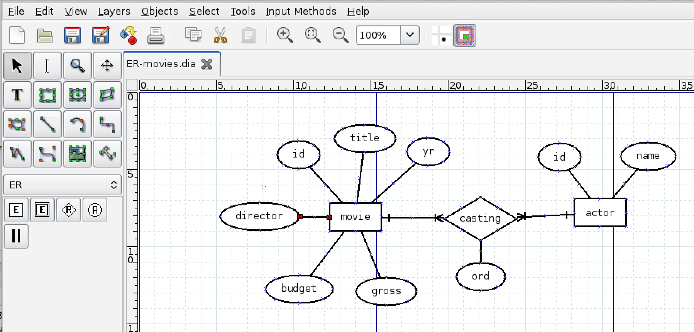
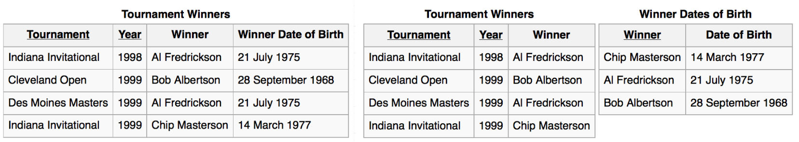

## Kako načrtujemo podatkovne baze?

- Pogovorimo se s končnimi uporabniki in zberemo zahteve.
- Narišemo konceptualni E-R Model (ali UML model).
- Pretvorimo E-R model v množico relacij.
- Izvedemo normalizacijo relacij (način eliminiranja podvajanja podatkov).
- Implementiramo podatkovno bazo v sistemu RDBMS.


## Grafični prikaz modelov

- Podatkovno bazo, tabele in sklice lahko načrtujemo s pomočjo grafično podprtih orodij.
- Vizualizacija nam omogoča preglednejši pogled na tabele v podatkovni bazi.
- Na voljo je več orodij.
- Odprtokodno orodje [Dia](http://dia-installer.de/)
- Googlov [draw.io](http://draw.io)
- OPOZORILO: sklice med tabelami v angleščini imenujemo tudi "relationship". V slovenščino to po tradiciji malce nerodno prevedemo v "relacija" (v relacijski algebri pa velja relacija = tabela) 
- Pazimo na kontekst uporabe pojma "relacija".


## E-R model

```{r echo=FALSE, out.width='60%'}
knitr::include_graphics('./slike/oracle_ER.png')
```

<font size="2px">Vir: Oracle</font>


## [E-R model in Dia](03-nacrtovanje-baz/ER-movies.dia)

```{r echo=FALSE, out.width='100%'}

```


## [UML model in Dia](03-nacrtovanje-baz/UML-movies.dia)

```{r echo=FALSE, out.width='100%'}
knitr::include_graphics('./slike/dia_UML.png')
```


## Normalizacija

- *Normalizacija* je proces, pri katerem sistematično pregledamo relacije (tabele) in anomalije. Ko identificiramo anomalijo, relacijo razbijemo na dve novi.
- Med procesom normalizacije ponavadi dobimo še globlji vpogled, kakšna bo interakcija med podatki v podatkovni bazi.
- Bolje je najti probleme v podatkovni bazi v času načrtovanja kot v času operacij.
- Normalizacija nam pomaga odstraniti redundantnost zapisa podatkov.
- Ampak zato moramo morda delati več `JOIN`-ov.
- Včasih se zaradi učinkovitosti namerno odločimo, da ne izvedemo nekega koraka normalizacije (npr. v podatkovnih skladiščih).


## Predpostavke za relacije (tabele)

- Vsaka vrstica ima za določen stolpec samo eno vrednost.
- Podatki v stolpcu so istega tipa.
- Isto ime stolpca se lahko v relaciji pojavi le enkrat.
- Vrstni red stolpcev ni pomemben.
- Nobeni dve vrstici ne smeta biti enaki.
- Vrstni red vrstic ni pomemben.


## Funkcijska odvisnost

- *Funkcijska odvisnost* opisuje odnos med stolpci znotraj iste relacije (tabele).
- Stolpec `B` je funkcijsko odvisen od (enega ali več) stolpcev `A1, ..., An`, če lahko s pomočjo vrednosti teh stolpcev v neki vrstici impliciramo vrednost stolpca `B` v tej vrstici.
- Primer: Številka študenta implicira študij študenta.
- Za nakazovanje funkcijske odvisnosti uporabimo simbol `->`.
- Stolpec je lahko funkcijsko odvisen od kombinacije večih stolpcev.
- Primer: `Solsko_leto, Predmet -> Predavatelj`.
- Funkcijske odvisnosti so pogojene tako s strukturo tabel kot z naravo podatkov.


## Ključ

- Ključ: eden ali več stolpcev, ki enolično določajo vrstico.
- Izbor ključev temelji na konkretni aplikaciji baze. Kaj je ključ, izvemo velikokrat iz konteksta in od uporabnikov.
- Za ključ vedno velja: `Ključ -> vsi ostali stolpci`.
- Obstajajo lahko funkcijske odvisnosti, ki na levi strani nimajo (samo) ključev.
- Kaj z njimi?


## Vrste normalizacij

- Prva normalna oblika (1NF)
- Druga normalna oblika (2NF)
- Tretja normalna oblika (3NF)
- Boyce--Codd-ova normalna oblika (BCNF)
- Četrta normalna oblika (4NF)
- Peta normalna oblika (5NF)
- Vsaka naslednja oblika vsebuje prejšnjo.


## Normalizacija

- Normalizacija v ustrezno obliko poteka na naslednji način:

    - Določimo ključe vsake tabele.
    - Določimo funkcijske odvisnosti.
    - Preverimo, ali so kršene zahteve ustrezne definicije.
    - Če pride do kršitve v neki tabeli, potem to tabelo razdelimo na dve tabeli.
    - Ponovno preverimo pogoje za izbrano obliko.
    - Če za nobeno tabelo ni kršena nobena zahteva, zaključimo.


## 1NF = predpostavke za relacijo

- Vsaka vrstica ima za določen stolpec samo eno vrednost. 
- Podatki v stolpcu so istega tipa.
- Isto ime stolpca se lahko pojavi v tabeli le enkrat. 
- Vrstni red stolpcev ni pomemben.
- Nobeni dve vrstici ne smeta biti enaki.
- Vrstni red vrstic ni pomemben.
- Primer: če se identični vrstici ponovita v neki tabeli, potem tabela že ni v 1NF.


## [2NF](http://holowczak.com/database-normalization/6/) {.build}

- Nadključ (ang. *superkey*): katera koli skupina stolpcev, za katere ne obstajata dve vrstici z istima vrednostma v teh stolpcih. Vsi drugi stolpci so funkcijsko odvisni od stolpcev, ki določajo ključ. 
- 1NF - vsi stolpci skupaj določajo nek ključ.
- (Minimalni) ključ (ang. *candidate key*): ključ, za katerega nobena stroga podmnožica ne predstavlja ključa.
- Primarni ključ: izbrani minimalni ključ.
- Neključni stolpec: stolpec, ki ni v nobenem minimalnem ključu.


## 2NF {.build}

- 1NF + nobena stroga podmnožica kakega minimalnega ključa funkcijsko ne določa kakega neključnega stolpca.

```{r echo=FALSE, out.width='100%'}

```


## [3NF](http://holowczak.com/database-normalization/7/) {.build}

- Pogoj: relacija je v 2NF in nimamo tranzitivnih funkcijskih odvisnosti.
- Tranzitivne funkcijske odvisnosti: 
    - iz `A -> B`, `B -> C` sledi `A -> C`.

```{r echo=FALSE, out.width='100%'}

```


## [BCNF](http://holowczak.com/database-normalization/8/) {.build}

- Boyce--Codd-ova normalna oblika.
- Pogoj: relacija je v 3NF in za vsako funkcijsko odvisnost oblike `A1, ..., An -> B` velja, da stolpci `A1, ..., An` predstavljajo ključ.
- Torej: ne obstajajo nobene druge funkcijske odvisnosti razen od ključev.
- Običajno normaliziramo vsaj do te oblike.


## Multifunkcijska odvisnost {.build}

- Multifunkcijsko odvisnost zapišemo kot `A ->> B`.
- Naj `C` predstavlja vse stolpce, razen stolpcev, določenih v `A` in `B`. Zapis `(x, y, z)` predstavlja "bločno" zapisano vrstico po skupinah stolpcev `A`, `B`, `C`.
- Če se pojavita vrstici `(a, b, c)` in `(a, d, e)`, potem morata obstajati vrstici `(a, b, e)` in `(a, d, c)`.


## [4NF]((http://holowczak.com/database-normalization/9/))

- Pogoj: relacija je v BCNF in nima *multifunkcijskih odvisnosti*.
- Primer: vsak predmet (`Course`) ima predpisan nabor knjig (`Book`) in nabor predavateljev (`Lecturer`)
  ```{r echo=FALSE, out.width='30%', fig.align="center"}
  
  ```
- Izbira knjig za predmet je neodvisna od izbir predavatelja, zato dodajanje knjige (ali predavatelja) zahteva dodajanje ustreznih kombinacij.
- `Course ->> Book`, `Course ->> Lecturer` 


## Ostale oblike

- Ostalih višjih normaliziranih oblik si ne bomo ogledali.
- Slike tabel v angleščini so pridobljene iz Wikipedie (licenca Creative Commons).
