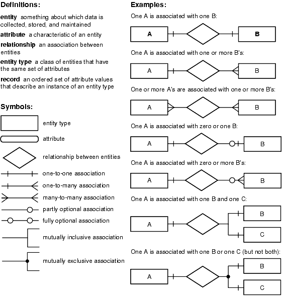
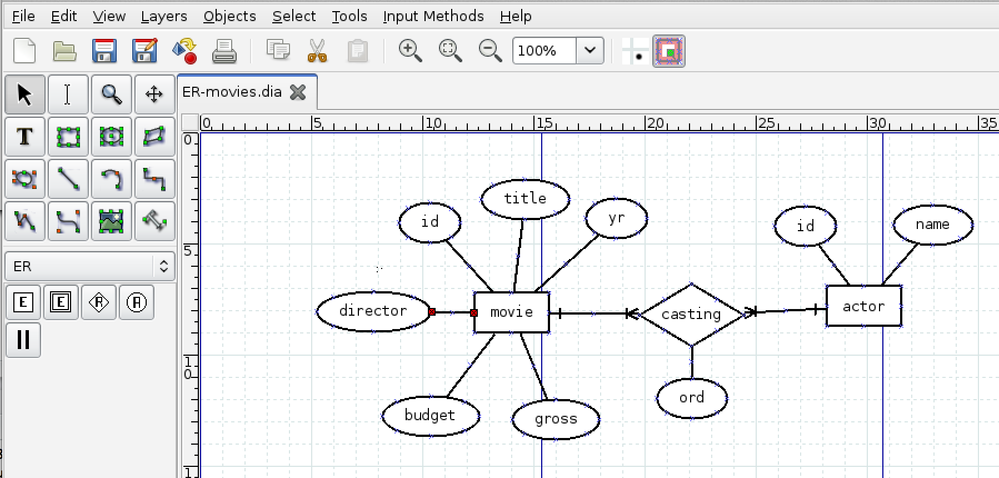
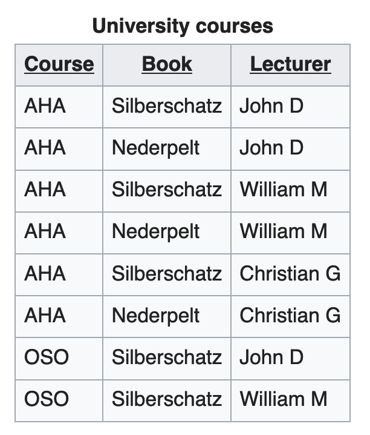

# Kako načrtujemo podatkovne baze?

* Pogovorimo se s končnimi uporabniki in zberemo zahteve.
* Narišemo konceptualni E-R model (ali UML model).
* Pretvorimo E-R model v množico relacij.
* Izvedemo normalizacijo relacij (način eliminiranja podvajanja podatkov).
* Implementiramo podatkovno bazo v sistemu RDBMS.

---

# Grafični prikaz modelov

* Podatkovno bazo, tabele in sklice lahko načrtujemo s pomočjo grafično podprtih orodij.
* Vizualizacija nam omogoča preglednejši pogled na tabele v podatkovni bazi.
* Na voljo je več orodij.
  - Odprtokodno orodje [Dia](http://dia-installer.de/)
  - Googlov [draw.io](http://draw.io)
* OPOZORILO: sklice med tabelami v angleščini imenujemo tudi "relationship". V slovenščino to po tradiciji malce nerodno prevedemo v "relacija" (v relacijski algebri pa velja relacija = tabela) 
* Pazimo na kontekst uporabe pojma "relacija".

---

# E-R model

<small>Vir: Oracle</small>

---

# [E-R model in Dia](03-nacrtovanje-baz/ER-movies.dia)

---

# [UML model in Dia](03-nacrtovanje-baz/UML-movies.dia)

---

# Normalizacija

* *Normalizacija* je proces, pri katerem sistematično pregledamo relacije (tabele) in anomalije. Ko identificiramo anomalijo, relacijo razbijemo na dve novi.
* Med procesom normalizacije ponavadi dobimo še globlji vpogled, kakšna bo interakcija med podatki v podatkovni bazi.
* Bolje je najti probleme v podatkovni bazi v času načrtovanja kot v času operacij.
* Normalizacija nam pomaga odstraniti redundantnost zapisa podatkov.
* Ampak zato moramo morda delati več `JOIN`-ov.
* Včasih se zaradi učinkovitosti namerno odločimo, da ne izvedemo nekega koraka normalizacije (npr. v podatkovnih skladiščih).

---

# Predpostavke za relacije (tabele)

* Vsaka vrstica ima za določen stolpec samo eno vrednost.
* Podatki v stolpcu so istega tipa.
* Isto ime stolpca se lahko v relaciji pojavi le enkrat.
* Vrstni red stolpcev ni pomemben.
* Nobeni dve vrstici ne smeta biti enaki.
* Vrstni red vrstic ni pomemben.

---

# Funkcijska odvisnost

* *Funkcijska odvisnost* opisuje odnos med stolpci znotraj iste relacije (tabele).
* Stolpec `B` je funkcijsko odvisen od (enega ali več) stolpcev `A1, ..., An`, če lahko s pomočjo vrednosti teh stolpcev v neki vrstici impliciramo vrednost stolpca `B` v tej vrstici.
* Primer: številka študenta implicira študij študenta.
* Za nakazovanje funkcijske odvisnosti uporabimo simbol `->`.
* Stolpec je lahko funkcijsko odvisen od kombinacije večih stolpcev.
* Primer: `Solsko_leto, Predmet -> Predavatelj`.
* Funkcijske odvisnosti so pogojene tako s strukturo tabel kot z naravo podatkov.

---

# Ključ

* Ključ: eden ali več stolpcev, ki enolično določajo vrstico.
* Izbor ključev temelji na konkretni aplikaciji baze. Kaj je ključ, izvemo velikokrat iz konteksta in od uporabnikov.
* Za ključ vedno velja: `Ključ -> vsi ostali stolpci`.
* Obstajajo lahko funkcijske odvisnosti, ki na levi strani nimajo (samo) ključev.
* Kaj z njimi?

---

# Vrste normalizacij

* Prva normalna oblika (1NF)
* Druga normalna oblika (2NF)
* Tretja normalna oblika (3NF)
* Boyce-Codd-ova normalna oblika (BCNF)
* Četrta normalna oblika (4NF)
* Peta normalna oblika (5NF)
* Vsaka naslednja oblika vsebuje prejšnjo.

---

# Normalizacija

* Normalizacija v ustrezno obliko poteka na naslednji način:

    - Določimo ključe vsake tabele.
    - Določimo funkcijske odvisnosti.
    - Preverimo, ali so kršene zahteve ustrezne definicije.
    - Če pride do kršitve v neki tabeli, potem to tabelo razdelimo na dve tabeli.
    - Ponovno preverimo pogoje za izbrano obliko.
    - Če za nobeno tabelo ni kršena nobena zahteva, zaključimo.

---

# 1NF = predpostavke za relacijo

* Vsaka vrstica ima za določen stolpec samo eno vrednost. 
* Podatki v stolpcu so istega tipa.
* Isto ime stolpca se lahko pojavi v tabeli le enkrat. 
* Vrstni red stolpcev ni pomemben.
* Nobeni dve vrstici ne smeta biti enaki.
* Vrstni red vrstic ni pomemben.
* Primer: če se identični vrstici ponovita v neki tabeli, potem tabela že ni v 1NF.

---

# [2NF](http://holowczak.com/database-normalization/6/)

* Nadključ (ang. *superkey*): katera koli skupina stolpcev, za katere ne obstajata dve vrstici z istima vrednostma v teh stolpcih. Vsi drugi stolpci so funkcijsko odvisni od stolpcev, ki določajo ključ. 
* 1NF - vsi stolpci skupaj določajo nek ključ.
* (Minimalni) ključ (ang. *candidate key*): ključ, za katerega nobena stroga podmnožica ne predstavlja ključa.
* Primarni ključ: izbrani minimalni ključ.
* Neključni stolpec: stolpec, ki ni v nobenem minimalnem ključu.

---

# 2NF

* 1NF + nobena stroga podmnožica kakega minimalnega ključa funkcijsko ne določa kakega neključnega stolpca.
  

---

# [3NF](http://holowczak.com/database-normalization/7/)

* Pogoj: relacija je v 2NF in nimamo tranzitivnih funkcijskih odvisnosti.
* Tranzitivne funkcijske odvisnosti: 
    - iz `A -> B`, `B -> C` sledi `A -> C`.
  

---

# [BCNF](http://holowczak.com/database-normalization/8/)

* Boyce-Codd-ova normalna oblika.
* Pogoj: relacija je v 3NF in za vsako funkcijsko odvisnost oblike `A1, ..., An -> B` velja, da stolpci `A1, ..., An` predstavljajo ključ.
* Torej: ne obstajajo nobene druge funkcijske odvisnosti razen od ključev.
* Običajno normaliziramo vsaj do te oblike.

---

# Multifunkcijska odvisnost

* Multifunkcijsko odvisnost zapišemo kot `A ->> B`.
* Naj `C` predstavlja vse stolpce, razen stolpcev, določenih v `A` in `B`. Zapis `(x, y, z)` predstavlja "bločno" zapisano vrstico po skupinah stolpcev `A`, `B`, `C`.
* Če se pojavita vrstici `(a, b, c)` in `(a, d, e)`, potem morata obstajati vrstici `(a, b, e)` in `(a, d, c)`.

---

# [4NF]((http://holowczak.com/database-normalization/9/))

* Pogoj: relacija je v BCNF in nima *multifunkcijskih odvisnosti*.
* Primer: vsak predmet (`Course`) ima predpisan nabor knjig (`Book`) in nabor predavateljev (`Lecturer`).
  
* Izbira knjig za predmet je neodvisna od izbir predavatelja, zato dodajanje knjige (ali predavatelja) zahteva dodajanje ustreznih kombinacij.
* `Course ->> Book`, `Course ->> Lecturer`

---

# Ostale oblike

* Ostalih višjih normalnih oblik si ne bomo ogledali.
* Slike tabel v angleščini so pridobljene iz Wikipedie (licenca Creative Commons).
