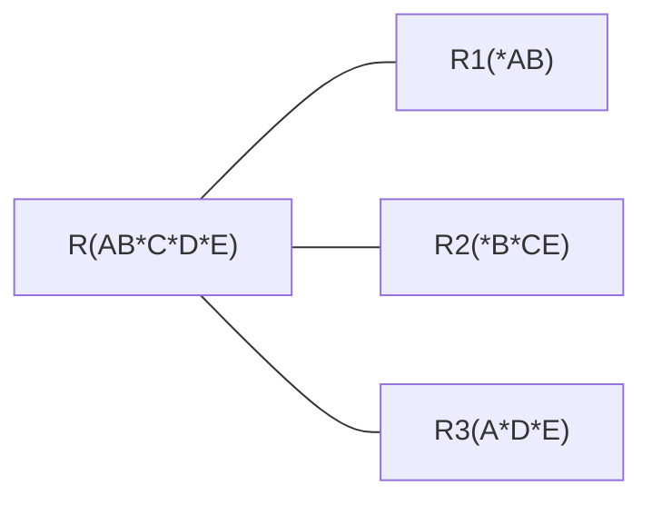
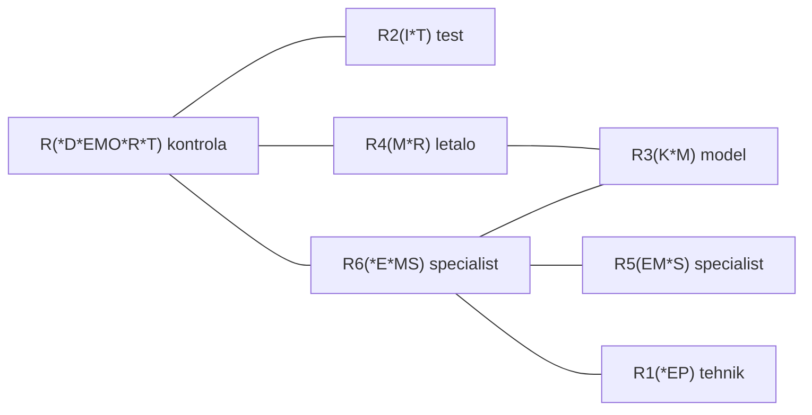

# Osnove podatkovnih baz - vaje 2.4.2020

---

## Normalizacija

Dana je relacija <i>$R(S)$</i> z množico atributov <i>$S$</i> in funkcijskimi odvisnostmi oblike <i>$X \to A$</i>, kjer je <i>$X \subseteq S$</i> in <i>$A \in S$</i>.

Lastnosti funkcijskih odvisnosti:

* **Refleksivnost**: <i>$A \in X \Rightarrow X \to A$</i>
* **Tranzitivnost**: <i>$(\forall A \in Y: X \to A) \land Y \to B \Rightarrow X \to B$</i>
* **Povečanje**: <i>$X \to A \Rightarrow XB \to A$</i>

----

Ključi:

* Množica <i>$K \subseteq S$</i> je **nadključ**, če velja <i>$K \to S$</i>.
* Množica <i>$K \subseteq S$</i> je **ključ**, če je minimalen nadključ - tj., za vsak <i>$A \in K$</i> velja <i>$K \setminus \{A\} \not\to S$</i>.

----

Normalne oblike:

* **3NF**: za vsako funkcijsko odvisnost <i>$X \to A$</i> velja

  $$
  A \in X \quad \lor \quad
  X \text{ vsebuje ključ} \quad \lor \quad
  A \text{ je del ključa.}
  $$

* **BCNF**: za vsako funkcijsko odvisnost <i>$X \to A$</i> velja

  $$
  A \in X \quad \lor \quad
  X \text{ vsebuje ključ.}
  $$

---

### Naloga 1

Dana je relacija <i>$R(ABCDE)$</i> s funkcijskimi odvisnostmi <i>$A \to B$</i>, <i>$BC \to E$</i> in <i>$DE \to A$</i>. Najdi vse ključe za <i>$R$</i>. Ali je <i>$R$</i> v 3NF/BCNF?

---

Izpeljane funkcijske odvisnosti:

$$
\begin{aligned}
A &\to B \\
BC &\to E \\
DE &\to A \\[1ex]
AC &\to B \\
AC &\to C \\
AC &\to E \\[1ex]
BCD &\to D \\[1ex]
ACD &\to B \\
ACD &\to E \\[1ex]
BCD &\to A \\
BCD &\to E \\[1ex]
CDE &\to A \\
CDE &\to B
\end{aligned}
$$

Ključi: ACD, BCD, CDE

| fun. odv.         | 3NF | BCNF |
| ----------------- | --- | ---- |
| <i>$A \to B$</i>  | ja  | ne   |
| <i>$BC \to E$</i> | ja  | ne   |
| <i>$DE \to A$</i> | ja  | ne   |

$R$ je v 3NF, ni v BCNF.

Primer podatkov:

| A | B | C | D | E  |
| - | - | - | - | -- |
| 1 | a | x | Q | Z' |
| 1 | a | y | R | W  |
| 2 | a | x | S | Z' |
| 2 | a | z | S | Z  |

Anomalija spreminjanja: če popravimo Z v Z' v stolpcu E prve vrstice, moramo to ponoviti še v tretji vrstici.



V SQL lahko za to poskrbimo z določilom `ON UPDATE CASCADE` pri določitvi tujih ključev.

---

### Naloga 2

Imejmo sledeče atribute z ER diagrama [letališčne baze](https://hackmd.io/nF9x0FvmRjy_nt3b5QFBSg#Naloga-3):

| oznaka | opis                        |
| ------ | --------------------------- |
| D      | datum kontrole              |
| E      | EMŠO tehnika                |
| I      | ime testa                   |
| K      | kapaciteta letala           |
| M      | model letala                |
| O      | dosežena ocena pri kontroli |
| P      | plača tehnika               |
| R      | reg. št. letala             |
| S      | oznaka specializacije       |
| T      | test                        |

Določi funkcijske odvisnosti med zgornjimi atributi, če lahko test na nekem letalu izvaja samo tisti tehnik, ki je specialist za model letala.

Pretvori shemo v 3NF. Ali se sklada s shemo, dobljeno iz ER diagrama?

----

$$
\begin{aligned}
E &\to P & \text{ok} \\
T &\to I & \text{ok} \\
M &\to K & \text{ok} \\
R &\to M & \text{ok} \\
S &\to E & \text{3NF ok} \\
S &\to M & \text{ok} \\
EM &\to S & \text{3NF ok} \\
DERT &\to O & \text{BCNF} \\[1ex]
DRT &\to IKM \\
DERT &\to IKMOPS \\
DRST &\to EIKMOP
\end{aligned}
$$

Ključi: DERT, DRST



---

### Naloga 3

Dane so sledeče podrelacije relacije <i>$R(ABCDEFGHI)$</i> skupaj s funkcijskimi odvisnostmi.

1. <i>$R_1(ABCDE)$</i>, <i>$A \to B$</i>, <i>$C \to D$</i>
2. <i>$R_2(ABF)$</i>, <i>$AC \to E$</i>, <i>$B \to F$</i>
3. <i>$R_3(AD)$</i>, <i>$D \to G$</i>, <i>$G \to H$</i>
4. <i>$R_4(DCGH)$</i>, <i>$A \to I$</i>, <i>$I \to A$</i>
5. <i>$R_5(ACEI)$</i>

Za vsak primer ugotovi, ali je podrelacija v BCNF, in če ni, jo pretvori v BCNF.

----

1. Ključ: ACE

   ```mermaid
   graph LR

   R["R(*A*C*E)"] --- R1["R1(*AB)"]
   R --- R2["R2(*CD)"]
   ```

2. Ključ: AB

   ```mermaid
   graph LR

   R["R(*A*B)"] --- R1["R1(*BF)"]
   ```

3., 4., 5. so v BCNF.

---

### Naloga 4

Dana je relacija <i>$R(ABCD)$</i> in sledeče množice funkcijskih odvisnosti.

1. <i>$C \to D$</i>, <i>$C \to A$</i>, <i>$B \to C$</i>
2. <i>$B \to C$</i>, <i>$D \to A$</i>
3. <i>$ABC \to D$</i>, <i>$D \to A$</i>
4. <i>$A \to B$</i>, <i>$BC \to D$</i>, <i>$A \to C$</i>
5. <i>$AB \to C$</i>, <i>$AB \to D$</i>, <i>$C \to A$</i>, <i>$D \to B$</i>

Za vsako ugotovi, v kateri normalni obliki je <i>$R$</i>, in jo pretvori v BCNF.

----

1. Ključ: B; ni v 3NF

   ```mermaid
   graph LR

   R["R(*BC)"] --- R1["R1(A*CD)"]
   ```

2. Ključ: BD; ni v 3NF

   ```mermaid
   graph LR

   R["R(*B*D)"] --- R1["R1(*BC)"]
   R --- R2["R2(A*D)"]
   ```

3. Ključa: ABC, BCD; je v 3NF, ni v BCNF

   ```mermaid
   graph LR

   R["R(*A*B*CD)"] --- R1["R1(A*D)"]
   ```

4. Ključ: A, ni v 3NF

   ```mermaid
   graph LR

   R["R(*ABC)"] --- R1["R1(*B*CD)"]
   ```

5. Ključi: AB, AD, BC, CD; je v 3NF, ni v BCNF

   ```mermaid
   graph LR

   R["R(*A*BCD)"] --- R1["R1(A*C)"]
   R --- R2["R2(B*D)"]
   ```
